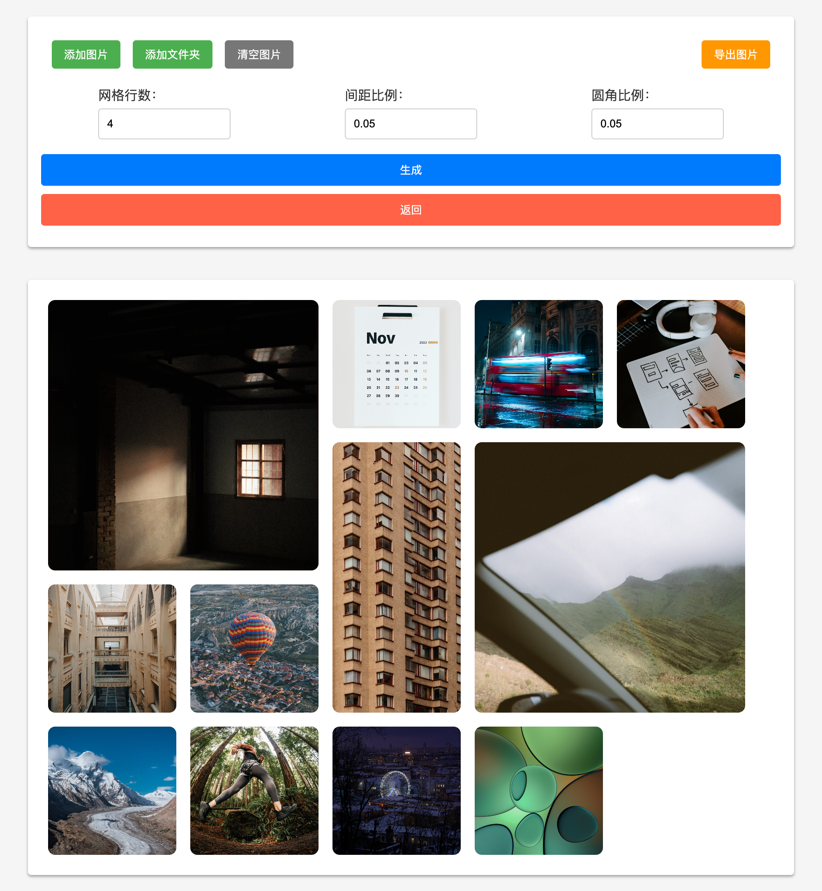

# 自适应图片网格排版工具

[在线体验](https://grid.6-79.cn)，核心算法由[Rizya](https://github.com/Jyonn/Rizya-Minigram)提供。

## 使用方法

1. 上传本地图片或文件夹
2. 设置网格行数、间距比例和圆角比例
3. 点击“生成”按钮，获得生成预览图
4. 点击“导出”按钮，使用截屏工具或开发者工具导出图片

## 项目进展

- [ ] 支持元网格设置
- [ ] 支持图片拖拽上传
- [x] 支持网格行数、间距比例和圆角比例设置
- [x] 上传本地图片
- [x] 上传本地文件夹
- [x] 生成预览图
- [x] 导出图片

## 排版样例

